# Testování spotřeby vody
Pro můj statistický experiment jsem se rozhodl zkoumat data denní spotřeby vody obytného domu
čítající 31 bytů za září 2022. Zároveň je ke každému záznamu spotřeby uvedeno číslo bytu, 
průměrný počet osob v daném měsíci a procentuelně vyjádřená plocha bytu vzhledem k celku.

Data jsou dále logicky členěna do 3 skupin, a to podle 3 oddělených vchodů/(schodišť) budovy (A, B, C).

Vzhledem k GDPR a zachování anonymity vlastníků jsem zpermutoval čísla bytů(a samozřejmě neuvádím vlastníky/zdroj).

Vešekerá data(ve formátu .csv) stejně tak jako scripty použité k analýze dat jsou k nalezení na [github](https://github.com/Cross-bit/stat_projekt). Zároveň zde pro úplnost přikládám i odkaz na formátovanou tabulku vstupních [naměřených hodnot]()

Výstupy budu typicky zaokrouhlovat na 3 desetinná místa. Nicméně je samozřejmé, že knihovny které budu používat budou pracovat s vyšší přesností, čímž může ve výstupech dojít k nepatrnému zkreslení. 

## Odstranění outliers
Jako první je potřeba prozkoumat, zdali se v datech nevyskytují záznamy, které by nemusely mít dostatečnou vypovídající hodnotu o skutečné spotřebě, byly neúplné či zkreslené a mohly by tím 
vnést do výsledných statistik významné chyby.

Pro nalezení těchto zavádějících dat, můžeme využít metody explorační analýzi jako jsou např. box ploty, scatter ploty apod.

### Box plot analýza dat
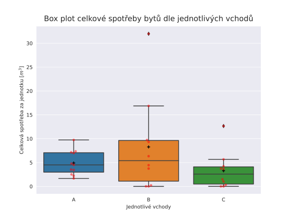

obr. 1: Box plot celkové spotřeby vody jednotlivých vchodů, hotnoty jsou vyznačeny červeně (rozkmit hodnot po horizontální ose je pouze pro lepší čitelnost), černé křížky značí mean.

<table border="1" class="dataframe">
  <thead>
    <tr style="text-align: right;">
      <th>vchod</th>
      <th>min</th>
      <th>max</th>
      <th>mean</th>
      <th>Q1</th>
      <th>Q3</th>
      <th>median</th>
      <th>upper whisker</th>
      <th>lower whisker</th>
    </tr>
  </thead>
  <tbody>
    <tr>
      <td>A</td>
      <td>1.666</td>
      <td>9.732</td>
      <td>4.898273</td>
      <td>2.98200</td>
      <td>7.06250</td>
      <td>4.5090</td>
      <td>13.183250</td>
      <td>-3.138750</td>
    </tr>
    <tr>
      <td>B</td>
      <td>0.000</td>
      <td>31.985</td>
      <td>8.264600</td>
      <td>1.09675</td>
      <td>9.62600</td>
      <td>5.3915</td>
      <td>22.419875</td>
      <td>-11.697125</td>
    </tr>
    <tr>
      <td>C</td>
      <td>0.006</td>
      <td>12.652</td>
      <td>3.277800</td>
      <td>0.48850</td>
      <td>4.09975</td>
      <td>2.5720</td>
      <td>9.516625</td>
      <td>-4.928375</td>
    </tr>
  </tbody>
</table>
Tab. 1: Statistiky hodnot pro jednotlivé vchody.
 

Na obrázku (1) je vidět box plot všech naměřených hodnot rozdělený dle 3 jednotlivých vchodů domu. Vykreslená data byla zpracována využitím python balíčku pandas a seaborn, které pro identifikování outlierů používá metodu Tukey (viz. kód pro výpočet hodnot), konkrétní hodnoty jsou poté uvedeny v tabulce (1).

Z grafu je patrné, že vchody B a C obsahují dva byty, kterým byla naměřená spotřeba výrazně se lyšící od ostatních naměřených dat. To v našem případě použitím metody Tukey znamená:
$$ x_B = 37,015 > Q3 + IQR \cdot 1.5$$
$$ x_C = 12,652 > Q3 + IQR \cdot 1.5$$

Kde $x_B$ je spotřeba outlieru bytu B, $x_C$ spotřeba outlieru bytu C, *Q3* je 3. kvartil hodnot a *IQR* je tzv. *Interquartile range* $IQR = Q3 - Q1$. 

Pokud se podíváme na outliery, které jsme získali podrobněji můžeme vidět, že $x_B$, která přísluší bytu 12 je i maximum všech naměřených hodnot vůbec. Zároveň si můžeme všimnout, že spotřeba vody zde byla vysoká 
především v 1. polovině měsíce. V daném bytě navíc byla v průměru za měsíc pouze jedna osoba. 

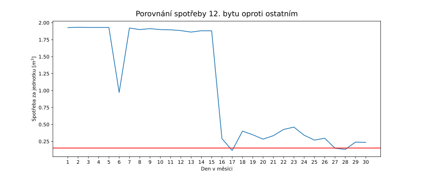
Modrá křivka je měsíční spotřeba bytu č. 12. Červená přímka je průměr všech bytů kromě b. č. 12

Jak je navíc vidět na obrázku výše v první polovině měsíce byla spotřeba vody značně nadprůměrná.
Můžeme tedy konstatovat, že se nejspíše jednalo o poruchu(např. protékající záchod), která byla 
16 den odstraněna. Pro naše účely analýzi však tento údaj z dat vyloučíme.

Druhý pozorovaný outlier $x_C$ má sice také nadprůměrnou spotřebu, ale na druhou stranu jsou v bytě osoby 3 a spotřeba je na denní bázi převážně konzistentní. Proto jsem se rozhodl tohoto outliera v datech ponechat.

Byt 19 ve vchodu B je v box-plotu uveden jako maximum (a ne jako outlier) nicméně z dat vidíme, že v bytě byl po celý měsíc pouze jeden člověk a jeho spotřeba byla vysoce nadprůměrná. Navíc zde 100 % víme, že byla chyba protékajícího boileru, čili i tento záznam nebudeme dále analyzovat. 

Dále jsem se z dat rozhodl vypustit záznamy, kde byla spotřeba během měsíce nulová, nebo téměř nulová. Jistě se jedná o byty ve kterých byl uvedený počet osob 0. 
U bytu 29 sice můžeme vidět drobnou spotřebu 21. den, nicméně tato hodnota je oproti průměrné spotřebě zanedbatelná. Může se tak jedant o chybu měření či např. lehce propouštějící uzávěr apod.

Byty 13, 14 sice mají uvedený počet obyvatel, ale spotřeba je přes všechny dny také nulová/zanedbatelná. Zde se jako rozumné vysvětlení jeví to, že lidé při záznamu počtu obyvatel(které se navíc koná až na konci roku) použili hodnoty, o kterých se domnívali, že jsou správná. Tedy tyto řádky také raději vynecháme.

Stejně tak dává smysl vypustit byt č. 6, kde ač v celkovém součtu je spotřeba v porovnání s ostatními byty možná, tak většina hodnot je nulová a všechna spotřeba je pak koncentrovaná v několika málo dnech. 
To může opět svědčit o chybě měření a tedy tento záznam také vypustíme.

Po odstranění všech outlierů nyní dostaneme Box plot na obrázku (4). Můžeme si také všimnout, že střední hodnoty spotřeb jednolivých vchodů (černé křížky) jsou mnohem blíže u sebe než tomu bylo v prvním případě. To nasvědčuje tomu, že data jsou nyní(minimálně napříč vchody) více konzistentní a v další analýze k nim můžeme přistupovat jednotně, s vyšší mírou důvěry.

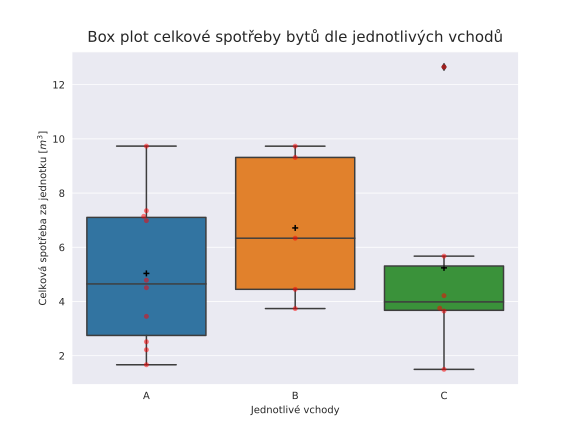

<table border="1" class="dataframe">
  <thead>
    <tr style="text-align: right;">
      <th></th>
      <th>vchod</th>
      <th>min</th>
      <th>max</th>
      <th>mean</th>
      <th>Q1</th>
      <th>Q3</th>
      <th>median</th>
      <th>upper whisker</th>
      <th>lower whisker</th>
    </tr>
  </thead>
  <tbody>
    <tr>
      <th>0</th>
      <td>A</td>
      <td>1.666</td>
      <td>9.732</td>
      <td>5.035000</td>
      <td>2.7475</td>
      <td>7.10225</td>
      <td>4.6475</td>
      <td>13.634375</td>
      <td>-3.784625</td>
    </tr>
    <tr>
      <th>1</th>
      <td>B</td>
      <td>3.739</td>
      <td>9.730</td>
      <td>6.713200</td>
      <td>4.4480</td>
      <td>9.31400</td>
      <td>6.3350</td>
      <td>16.613000</td>
      <td>-2.851000</td>
    </tr>
    <tr>
      <th>2</th>
      <td>C</td>
      <td>1.496</td>
      <td>12.652</td>
      <td>5.239667</td>
      <td>3.6745</td>
      <td>5.30850</td>
      <td>3.9845</td>
      <td>7.759500</td>
      <td>1.223500</td>
    </tr>
  </tbody>
</table>

## Nalezení vhodného modelu
Po odfiltrování zavádějících dat se můžeme podívat na vzorek jako celek a pokusit se nalézt vhodný model, který by naše data dobře popisoval. Pro začátek můžeme vynést všechny naměřené denní hodnoty do histogramu.

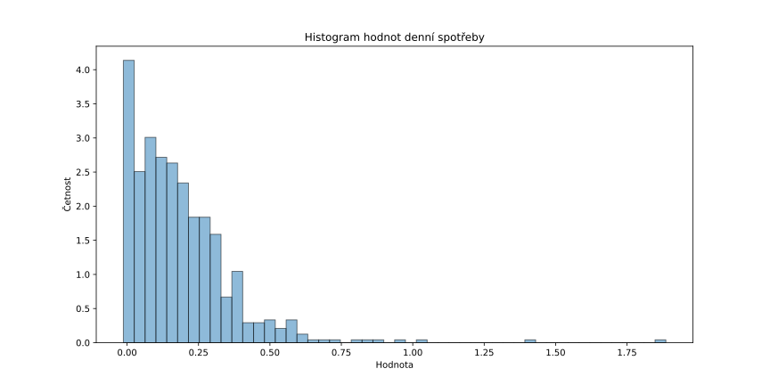

Z histogramu je patrné, že nejvyšší koncentrace hodnot je v okolí 0, poté četnost postupně klesá až na několik vzorků kde spořeba byla za den 1 $m^3$ a více[^1]. 

[^1]: Samozřejmě mohli bychom diskutovat i tyto výjimečné hodnoty např. opět pomocí boxplotů. Nicméně vzhledem k nízké četnosti lze usoudit, že spotřeba  mohla být skutečně takto vysoká a tedy je ve v datech necháme.

Klesání na první pohled velmi připomína exponencionální rozdělení, pro ověření, že by tomu tak skutečně mohlo být, dává smysl provést další analýzu vzorků.

[1]: https://www.mdpi.com/2073-4441/10/10/1481#B49-water-10-01481

[2]: https://statproofbook.github.io/P/exp-gam.html

### Q-Q plot analýza
K této analýze lze použít tzv. Q-Q ploty[[3]], které nám pomohou rozhodnout jaké distribuci jsou data nejvíce podobná. Konkrétně hledáme takový Q-Q plot, kde nanesené hodnoty kvantilů z našich vzorků a hodnoty kvantilů distribuce si budou co nejvíce odpovídat. To se v grafu projeví tak, že většina hodnot se bude nacházet na 45 stupňové referenční přímce(y=x). Naopak pro distribuce zásadně odlišné od té skutečné, budou nanesené hodnoty od přímky divergovat.

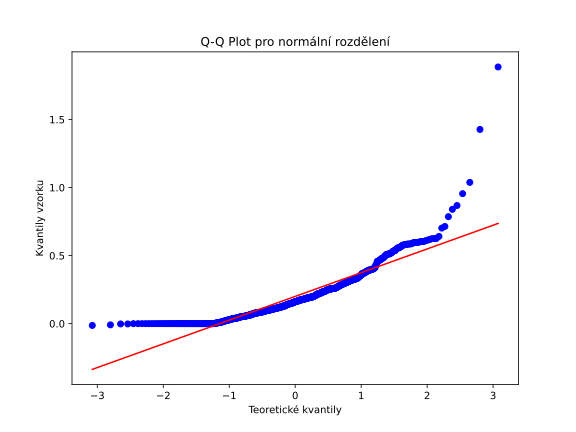

Pro normální rozdělení dostáváme Q-Q plot, kde ikdyž se může zdát že křivka v jisté části následuje referenční přímku, tak rozhodně většina bodů leží mimo a navíc koncové body silně divergují.
Odtud se tedy zdá(resp. ono je to také zjevné z histogramu), že spotřeba vody(minimálně tedy náš vzorek) neodpovídá normálnímu rozdělení.

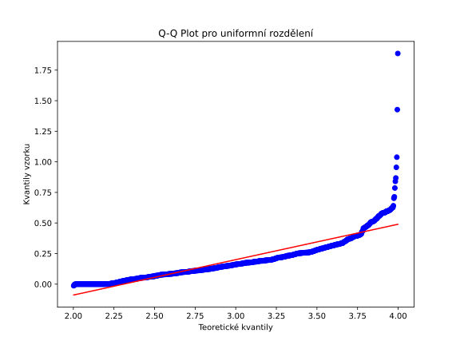

Pro úplnost jsem se také rozhodl podívat na Q-Q plot uniformního rozdělení. Zde je situace velice obdobná normálnímu, ikdyž se zdá, že zde je situace o něco lepší, alespoň co se sledování referenční přímky týče. Většina bodů je však také podstatně mimo a tedy i tuto variantu zavrhneme.

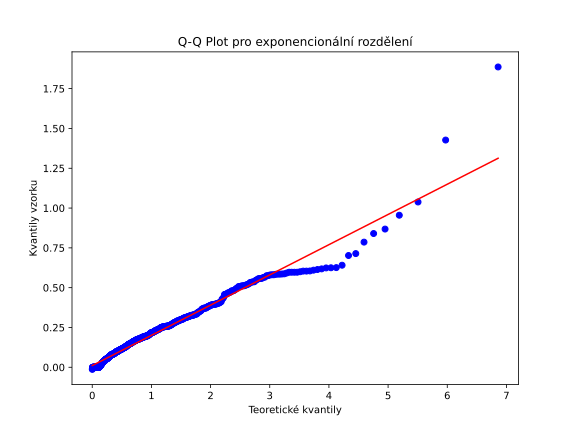

Když se tedy podíváme na rozdělení, které by naše data připomínají vidíme, že většina bodů odpovídá referenční přímce. Ze začátku je situace velice dobrá nicméně pro vyšší hodnoty začínají data od přímky divergovat.

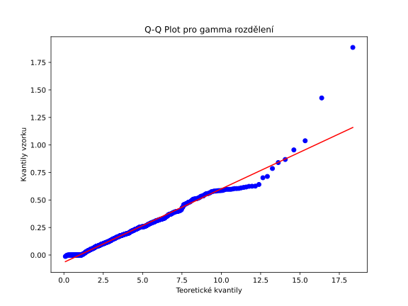

Velice podobnou situaci jako u exponencionálního dostaneme také pro gamma rozdělení.

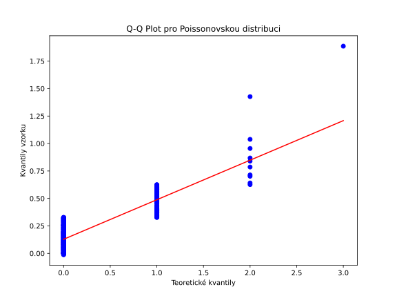

Pro jistotu ještě prověříme Poissonovo rozdělení, které by (pokud by byl náš vzorek nedostatečný) mohlo naše data také vysvětlovat. Konkrétně bylo použito rozdělení s parametrem $\lambda = S_n$. Z Q-Q plotu je patrné, že naše hodnoty se s referenční přímkou neshodují téměř vůbec a tedy toto rozdělení můžeme zavrhnout.

Kód pro generování je TODO: cesta

### Komentář k modelu
Z analýzi výše nám nejlépe vychází Q-Q plot pro exponencionální distribuci a gamma distribuci. Je dobré si však rozmyslet, zdali tento model skutečně dobře odpovídá našim datům. Exponencionální rozdělení typicky modeluje nezávislé časové intervaly, definující nějaký jev, který nastane v budoucnosti (čas před příchodem dalšího telefonního hovoru do call-centra, čas rozpadu atomu apod.). 

V našem případě se sice nejedná o časové intervaly, ale lze si data vysvětlit v prvé řadě tak, že většina domácností spotřebuje méně vody, protože lidé přes den nejsou doma a tím pozorujeme výraznou četnost hodnot nižší spotřeby. Na drouhou stranu, když lidé doma jsou, tak spotřebují podstateně více, ale tomu býva zase velmi zřídka.

V druhé řadě, spotřeby domácností v jednotlivých dnech jsou na sobě nezávislé. Protože je exponencionální rozdělení nezávislé (a tzv. memoryless), tak i z tohoto pohledu dává dobrý smysl tento model zde zkusit aplikovat.

Mimoto jako další ověření můžeme nalézt také oporu v podobných studiích[[1]], kde pro modelování byla použita právě zmíněná gamma distribuce. Protože jsou si však oba Q-Q ploty v našem případě velice podobné a protože exponenciální distribuce je pouze specialní[[2]] případ obecnější gamma distribuce, rozhodl jsem se zkusit data modelovat takto zjednodušeně.

[3]: https://www.itl.nist.gov/div898/handbook/eda/section3/qqplot.htm

### Nalezení parametru modelu metodou ML (maximální věrohodnosti)
Metodou maximální věrohodnosti můžeme jednoduše zjistit, že dobrým odhadem pro parametr $\hat{\lambda}$ 
je převrácená hodnota výběrového průměru vzorku $S_n$, tedy
$$\hat{\lambda} = \frac{1}{S_n}.$$

Po dosazení je v našem případě $\hat{\lambda}=5.462$.

[proof](https://www.statlect.com/fundamentals-of-statistics/exponential-distribution-maximum-likelihood)

Teoretickou pdf nyní můžeme vynést do histogramu dat. Vidíme, že model a data si na první pohled celkem dobře odpovídají.

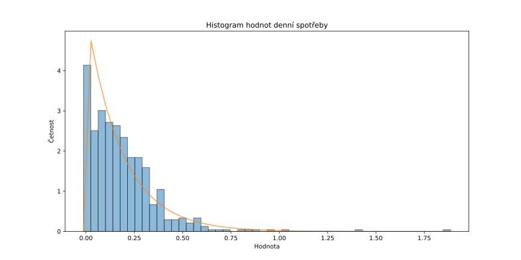

Nicméně, abychom měli jistotu, že náš model skutečně dobře koresponduje s daty, měli bychom ověřit platnost 
i numericky.

### Testování distribuce
Pro ověření, že náš model skutečně je nebo není správný použijeme tzv. KS-test (test Kolmogorov-Smirnova).

Vyslovme tedy nulovou a alternativní hypotézu:

$H_0$ – Data odpovídají exponencionálnímu rozdělení.

$H_a$ – Data neodpovídají exponencionálnímu rozdělení.

Zvolme hladinu významnosti $\alpha = 0.05$

KS funkce z knihovny scipy bere na vstupu naše vzorky dat a náhodně generovaný vzorek dat z našeho modelu (kvůli tomu se výsledná hodnota při každém spuštění bude lehce lišit) a vrací p-value.
Při spuštění byla poslední naměřená hodnota: $p-value = 0.0003314$ což je podstatně méně než $0.05$.

Protože nám p-hodnota vyšla podstatně menší než zvolená hladina významnosti, musíme tím pádem zamítnou $H_0$ a přijmout alternativní hypotézu $H_a$.
Zjistili jsme tedy, že i přesto, že Q-Q plot a i PDF v histogramu vypadali nadějně, zdá se že naše data nelze vysvětlit exponencionálním rozdělením. Jedním z důvodů by např. mohlo být, že KS test je velice citlivý i na malé odchylky od skutečné distribuce. Jak jsme navíc z Q-Q plotu viděli, tak ač se většina bodů držela relativně blízko referenční přímky, tak na konec nám jistá část začala podstatně divergovat. Je možné, že i právě kvůli tomu KS test takto významně $H_0$ zamítl.

## Nalezení konfidenčního intervalu střední hodnoty populace $\mu$
Přesnou distribuci dat tedy sice přesně neznáme, nicméně ale i tak se můžeme pokusit nalézt konfidenční interval pro střední hodnotu populace $\mu$.
Z CLT víme, že pokud je vzorek dostatečně velký (např. podstatně více než 30), tak nám zde odpadá požadavek na normalitu rozdělení. Dále pro určení budeme potřebovat rozptyl populace. Ten sice přesně neznáme, ale známe alespoň rozptyl dat celého roku (ke kterým mám přístup). Nejedná se tedy o rozptyl celé populace (která je hypoteticky v našem případě nekonečná nebo do konce životnosti měřidel apod.), takže zde jistá míra nepřesnosti stále bude, nicméně jako aproximace v našem případě bude dostačující.

Zvolme tedy hladinu spolehlivosti $(1-\alpha) = 0.95$. Směrodatná odchylka populace je $\sigma = 0.0513$, velikost vzorku je $n = 630$ $(dny \cdot pocetZaznamu)$, výběrový průměr vzorku $S_n = 0,183$ a pro $\theta = (1/\lambda)$ (protože expon $\mu = 1/\lambda$) hledáme konfidenční interval $C_n$ t.ž.: $\lim_{n\to\infty}P(\theta \in C_n ) = 1-\alpha$.

Pro horní a dolní mez intervalu $C_n$ máme v limitě
$$S_n \pm z_{\alpha/2} \cdot \frac{\sigma}{\sqrt{n}}.$$

Pro 95 % konfidenční interval($\alpha/2 = 0.025$) je *z-scozre* $z_{\alpha/2}=1.96$.
Po dosazení tak dostaneme pro $\mu$ populace konfidenční interval:
$$C_n = [0.179,0.187]$$

## Linearita počtu lidí v domácnosti a celkové spotřeby
Další analýza se bude zabývat závislostí, mezi počtem lidí v jednotce a celkové měsíční spotřeby.
Lze očekávat, že s větším počtem lidí v bytě bude také růst i spotřeba této jednotky. Dále bychom mohli očekávat, že každý člen domácnosti v průměru spotřebuje zhruba stejné množství vody a tedy, že i spotřeba se bude s každým dalším členem lineárně navyšovat.

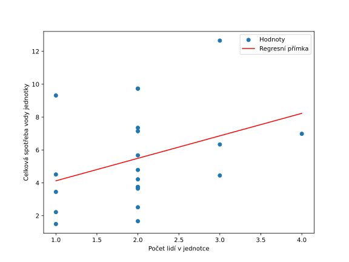

Dostaneme:

$R$ hodnotu: 0,354  
$R^2$ hodnotu: 0,125

Z grafu vidíme, že spotřeba má skutečně tendenci s vyšším počtem členů růst s 35 % pozitivní korelací vzorků.

Nicméně z hodnoty $R^2$ vidíme, že pouze okolo 12,5 % variace hodnot lze vysvětlit pouze pomocí počtu lidí v domácnosti.

Při pohledu na graf vidíme, že jistá lineání závislost mezi daty je. Zároveň však vidíme, že variace vzorků pro každou skupinu lidí je příliš velká a 
88 % spotřeby nelze vysvětlit pouze takto jednoduše.

Vysvětlení, která tak přicházejí v úvahu jsou, že individuelní spotřeba domácností může vysoce záviset na demografických charakteristikách jednotlivců
jako je věk, pohlaví, zvyklosti apod. nebo také na tom, kolik procet času jsou rodinní příslušníci skutečně doma. 
V důsledku toho pozorujeme velkou variaci vzorků spotřeb různých domácností i přesto, že průměrný měsíční počet osob je stejný.

## Závěr

TODO:

