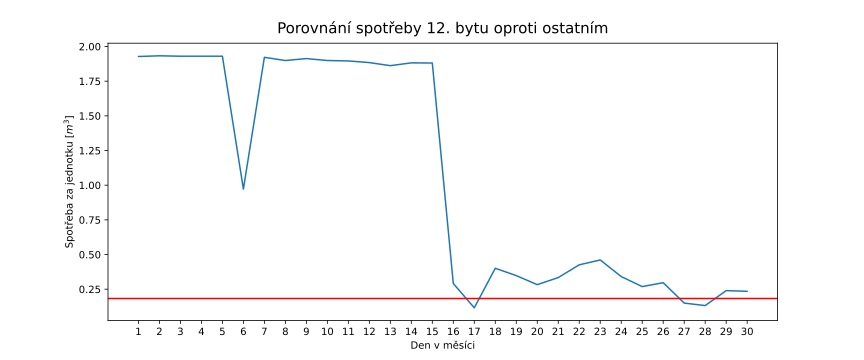

# Testování spotřeby vody
Pro můj statistický experiment jsem se rozhodl zkoumat data denní spotřeby vody obytného domu
čítající 31 bytů za září 2022. Zároveň je ke každému záznamu spotřeby uvedeno číslo bytu, 
průměrný počet osob v daném měsíci a procentuelně vyjádřená plocha bytu vzhledem k celku.

Data jsou dále logicky členěna do 3 skupin, a to podle 3 oddělených vchodů/(schodišť) budovy (A, B, C).

Vzhledem k GDPR a zachování anonymity vlastníků jsem zpermutoval čísla bytů(a samozřejmě neuvádím vlastníky/zdroj).

Vešekerá data(ve formátu .csv) stejně tak jako scripty použité k analýze dat jsou k nalezení na [github](https://github.com/Cross-bit/stat_projekt). Zároveň zde pro úplnost přikládám i odkaz na formátovanou tabulku vstupních [naměřených hodnot]()

Výstupy budu typicky zaokrouhlovat na 3 desetinná místa. Nicméně je samozřejmé, že knihovny které budu používat budou pracovat s vyšší přesností, čímž může ve výstupech dojít k nepatrnému zkreslení. 

## Odstranění outliers
Jako první je potřeba prozkoumat, zdali se v datech nevyskytují záznamy, které by nemusely mít dostatečnou vypovídající hodnotu o skutečné spotřebě, byly neúplné či zkreslené a mohly by tím 
vnést do výsledných statistik významné chyby.

Pro nalezení těchto zavádějících dat, můžeme využít metody explorační analýzi jako jsou např. box ploty, scatter ploty apod.

obr. 1: Box plot celkové spotřeby vody jednotlivých vchodů, hotnoty jsou vyznačeny červeně (rozkmit hodnot po horizontální ose je pouze pro lepší čitelnost), černé křížky značí mean.

<table border="1" class="dataframe">
  <thead>
    <tr style="text-align: right;">
      <th>vchod</th>
      <th>min</th>
      <th>max</th>
      <th>mean</th>
      <th>Q1</th>
      <th>Q3</th>
      <th>median</th>
      <th>upper whisker</th>
      <th>lower whisker</th>
    </tr>
  </thead>
  <tbody>
    <tr>
      <td>A</td>
      <td>1.666</td>
      <td>9.732</td>
      <td>4.898273</td>
      <td>2.98200</td>
      <td>7.06250</td>
      <td>4.5090</td>
      <td>13.183250</td>
      <td>-3.138750</td>
    </tr>
    <tr>
      <td>B</td>
      <td>0.000</td>
      <td>31.985</td>
      <td>8.264600</td>
      <td>1.09675</td>
      <td>9.62600</td>
      <td>5.3915</td>
      <td>22.419875</td>
      <td>-11.697125</td>
    </tr>
    <tr>
      <td>C</td>
      <td>0.006</td>
      <td>12.652</td>
      <td>3.277800</td>
      <td>0.48850</td>
      <td>4.09975</td>
      <td>2.5720</td>
      <td>9.516625</td>
      <td>-4.928375</td>
    </tr>
  </tbody>
</table>
Tab. 1: Statistiky hodnot pro jednotlivé vchody.
 

Na obrázku (1) je vidět box plot všech naměřených hodnot rozdělený dle 3 jednotlivých vchodů domu. Vykreslená data byla zpracována využitím python balíčku pandas a seaborn, které pro identifikování outlierů používá metodu Tukey (viz. kód pro výpočet hodnot), konkrétní hodnoty jsou poté uvedeny v tabulce (1).

Z grafu je patrné, že vchody B a C obsahují dva byty, kterým byla naměřená spotřeba výrazně se lyšící od ostatních naměřených dat. To v našem případě použitím metody Tukey znamená:
$$ x_B = 37,015 > Q3 + IQR \cdot 1.5$$
$$ x_C = 12,652 > Q3 + IQR \cdot 1.5$$

Kde $x_B$ je spotřeba outlieru bytu B, $x_C$ spotřeba outlieru bytu C, *Q3* je 3. kvartil hodnot a *IQR* je tzv. *Interquartile range* $IQR = Q3 - Q1$. 

Pokud se podíváme na outliery, které jsme získali podrobněji můžeme vidět, že $x_B$, která přísluší bytu 12 je i maximum všech naměřených hodnot vůbec. Zároveň si můžeme všimnout, že spotřeba vody zde byla vysoká 
především v 1. polovině měsíce. V daném bytě navíc byla v průměru za měsíc pouze jedna osoba. 

Modrá je měsíční spotřeba bytu č. 12. Červená čára je průměr všech bytů bez b. č. 12.

Jak je navíc vidět na obrázku výše v první polovině měsíce byla spotřeba vody značně nadprůměrná.
Můžeme tedy konstatovat, že se nejspíše jednalo o poruchu(např. protékající záchod), která byla 
16 den odstraněna. Pro naše účely analýzi však tento údaj z dat vyloučíme.

Druhý pozorovaný outlier $x_C$ má sice také nadprůměrnou spotřebu, ale na druhou stranu jsou v bytě osoby 3 a spotřeba je na denní bázi převážně konzistentní. Proto jsem se rozhodl tohoto outliera v datech ponechat.

Dále jsem se z dat rozhodl vypustit záznamy, kde byla spotřeba během měsíce nulová, nebo téměř nulová. Jistě se jedná o byty ve kterých byl uvedený počet osob 0. 
U bytu 29 sice můžeme vidět drobnou spotřebu 21. den, nicméně tato hodnota je oproti průměrné spotřebě zanedbatelná. Může se tak jedant o chybu měření či např. lehce propouštějící ventil apod.

Stejně tak dává smysl vypustit byt č. 6, kde ač v celkovém součtu je spotřeba v porovnání s ostatními byty možná, tak většina hodnot je nulová a všechna spotřeba je pak koncentrovaná v několika málo dnech. 
To může opět svědčit o chybě měření a tedy tento záznam také vypustíme.

Mohli bychom TODO: 13 14

Po odstranění všech outlierů nyní dostaneme Box plot na obrázku (4). Můžeme si také všimnout, že střední hodnoty spotřeb jednolivých vchodů(černé křížky) jsou mnohem blíže u sebe, než tomu bylo v prvním případě. To nasvědčuje tomu, že data jsou nyní(minimálně napříč vchody) více konzistentní a v další analýze k nim můžeme přistupovat jednotně, s vyšší mírou důvěry.

### Box plot analýza

## Hledání vhodného modelu
Po odfiltrování zavádějících dat se můžeme podívat na vzorek jako celek a pokusit se nalézt vhodný model, který by naše data dobře popisoval. Pro začátek můžeme vynést všechny naměřené denní hodnoty do histogramu.

// TODO: add picture

Jak je patrné, nejvyšší koncentrace hodnot je v okolí 0, poté četnost postupně klesá až na pár vzorů kde spořeba byla za den 1 $m^3$ a více[^1]. 

[^1]: Samozřejmě bychom mohli diskutovat i tyto výjimečné hodnoty pomocí boxplotů.

Jak je patrné, distribuce na obrázku výše má tvar charakteristický exponeionálnímu rozdělení. 

Klasickým postupem(který byl i ve scriptách) můžeme zjistit, že dobrým odhadem pro parametr $\hat{\lambda}$ 
je převrácená hodnota střední hodnoty, tedy:
$$\hat{\lambda} = \frac{1}{\mu}$$

[zdroj](https://www.statlect.com/fundamentals-of-statistics/exponential-distribution-maximum-likelihood)

Jak je vidět na obrázku, funkce 

### Nalezení confidenčního intervalu pro mean
Dále se můžeme pokusit nalézt 

$(1-\alpha) = 0.95$

Population variance:
0.0026316775684612245
Standard deviation:
0.051299878834761635

## Exponenciální rozdělení
Jak je vidět na histogramu, naměřené vzorky především v nižších hodnotách připomínají klesající exponencielu. Jediný 

Navíc protože mezi 

Naše H_0 hypotéza tedy v tomto případě bude:
Náhodný výběr má exponenionální rozdělení.
a jako alternativní hypotézu H_a zvolíme negaci H_0 tedy:
Náhodný výběr nená exponenciální rozdělení.

Pro test normality_test.py

Otázku, kterou bychom si mohli položit je, proč mají naše data
zrova toto rozdělení. Exponencionální rozdělení se typicky používá
pro modelování nezávislých časových událostí, konkrétně pravděpodobnost 
za jak dlouho nastane nějaký jev.

Dále pro "ověření", že můj model není až tak špatně zvolený, v podobných
studiiích[[1]], např. pro modelování byla použita gamma distribuce.
Ta by pro modelování dat také mohla být zvolena jak je z Q-Q grafu vidět.
Nicméně protože je v mém případě Q-Q graf obdobně dobrý(až na diskutované výchylky)
a protože exponenciální distribuce je pouze specialní[[2]] případ obecnější gamma distribuce, 
rozhodl jsem se modelovat data takto zjednodušeně.

[1]: https://www.mdpi.com/2073-4441/10/10/1481#B49-water-10-01481

[2]: https://statproofbook.github.io/P/exp-gam.html

Díky nalezenému modelu se nyní můžeme ptát na otázky typu:

Jaká je pravděpodobnost, že v náhodný den bude spotřeba větší/menší než X

# Personův Chi square test(test dobré shody)

V tomto testu rozdělíme data systolického tlaku do 5 kategorií, a to:
- normal: SYS < 120 **AND** DIA < 80
- elevated  120 <= SYS < 130 **AND** DIA < 80
- hypertension stage 1: 130 <= SYS < 140  **OR** 80 DIA < 90
- hypertension stage 2: 140 <= SYS  **OR** 90 <= DIA
- hypertension stage 3: 180 < SYS  **AND/OR** 120 < DIA

[Zdroj](https://www.health.harvard.edu/heart-health/reading-the-new-blood-pressure-guidelines)

Jako výchozí frekvence populace budeme uvažovat:
- normal: 46.2
- elevated: 17.7
- hypertension stage 1: 19.1
- hypertension stage 2: 12.7
- - hypertension stage 3: 4.4

4.4 46.2 17.7 19.1 12.7

V testu budeme předpokládat, že 
https://www.ahajournals.org/doi/abs/10.1161/HYPERTENSIONAHA.123.20900

[Zdroj](https://www.ncbi.nlm.nih.gov/pmc/articles/PMC8040133/)

